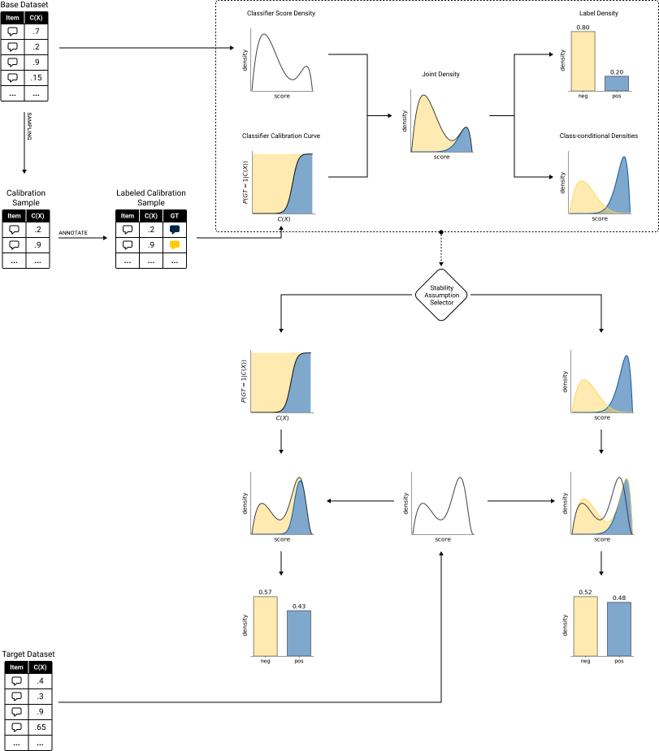

# Python package for [ICWSM Tutorial](https://avalanchesiqi.github.io/prevalence-estimation-tutorial/) "Prevalence Estimation in Social Media Using Black Box Classifiers"

## Setup
Go to the `pyquantifier` directory,
```bash
cd pyquantifier
```

### Setup Python venv and install requirements
```bash
python3 -m venv .venv
source .venv/bin/activate
python3 -m pip install --upgrade pip
python3 -m pip install -r requirements.txt
```

### Build and install Python package
```bash
python3 -m build
python3 -m pip install --force-reinstall dist/pyquantifier-0.0.1-py3-none-any.whl
```

## Tutorial Jupyter Notebooks
The tutorial includes four sections:
1. [Generating representations of joint distributions](/icwsm_tutorial/1-Generate-Joint-Distribution.ipynb)
<!-- 2. [Profiling the joint distribution for the base period](/examples/Sec1-Joint-Distribution-And-Naive-Approach.ipynb)
3. [Labeling a portion of data and using it for calibration](/examples/Sec2-Labeled-Sample-To-Calibration%20.ipynb)
4. [Extrapolating the joint distributions of the base period to a target period](/examples/Sec3-Extrapolating-To-Target-Dataset-Joint-Distribution.ipynb) -->

<!-- In each notebook, you will find the learning objectives, and a dozen of TODO code cells that we expect you to complete. -->

## Toxic comments on social media
[Estimating the Fraction of Toxic Comments on News Articles](/icwsm_tutorial/Toxicity-Calibrate-Extrapolate.ipynb)

### Tutorial Slides
The tutorial slides are available [here](https://docs.google.com/presentation/d/1_-hpHB2aZb8Cu5QUfRwEHWEAJX3AYnVnIEKu33RK0w0/edit?usp=sharing).

### The Calibration-Extrapolation Framework


### References and reading list
- [References and reading list](https://avalanchesiqi.notion.site/ed68d0b0d08942da9272556548adb82f?v=eeab4969721049419939a84d9867172c)
